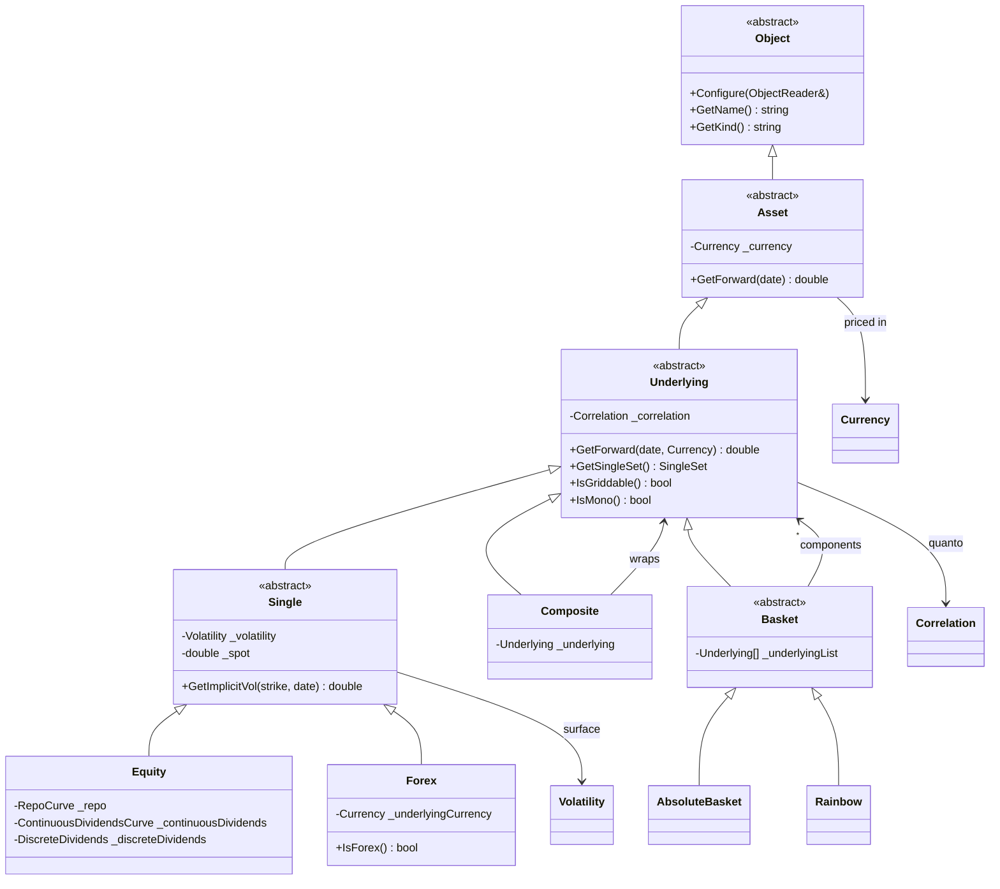
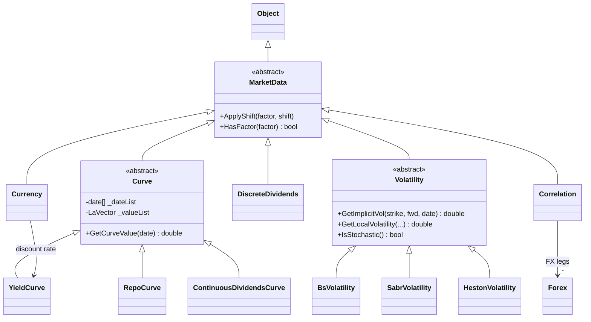
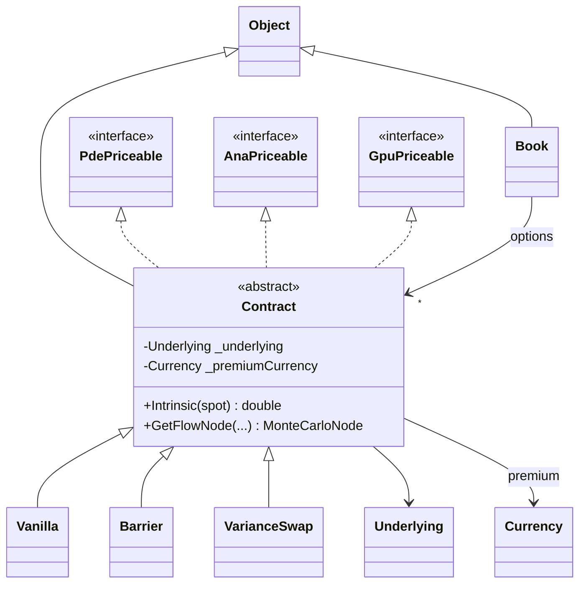
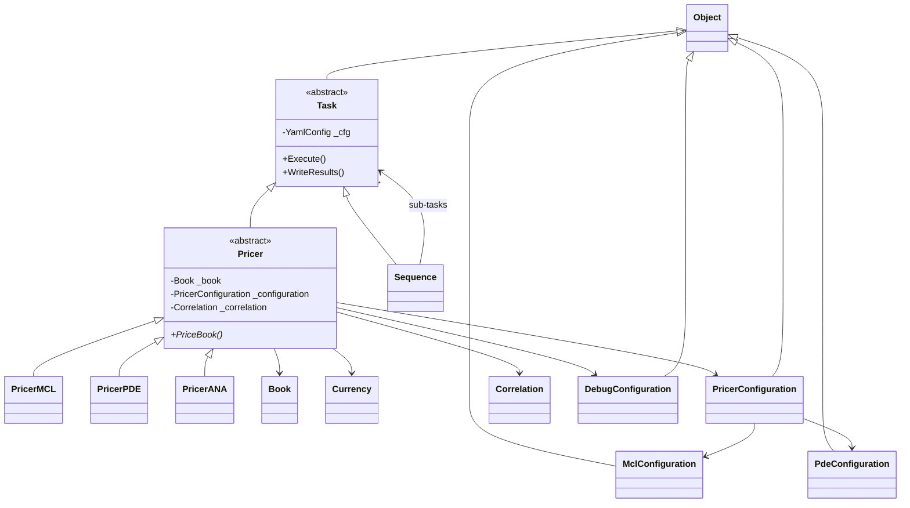
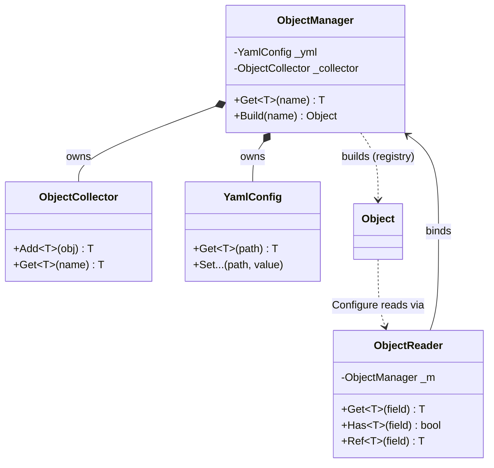

# Class diagrams

The object model in UML, grouped by subsystem. Diagrams are
[Mermaid](https://mermaid.js.org/) `classDiagram` blocks — they render directly on
GitHub and in most Markdown viewers.

Every domain type derives from `Object` and reads itself from the YAML book through
`Object::Configure(ObjectReader&)`; the `ObjectManager` builds the graph on demand
(see [Configuration & build](#configuration--build)).

`<|--` is inheritance (derived `<|--` base reads "derived is-a base"), `*--` is
composition/ownership, `-->` is a reference (non-owning pointer), and `..>` a
build/use dependency.

## Underlyings & assets

A single tradable name (`Equity` / `Forex`) **is** a single-asset underlying:
`Single` derives from `Underlying` directly (there is no `Mono` adapter). The
multi-asset shapes are `Composite` (quanto), `Basket` and `Rainbow`.

## Market data

## Contracts & book

`Contract` mixes in the per-engine pricing facets (`PdePriceable` / `AnaPriceable` /
`GpuPriceable`); a `Book` is the list of contracts priced together.

## Tasks & pricers

The registry picks the concrete `Pricer` from the configuration's `method`
(`mcl` / `pde` / `ana`; GPU is the `mcl` engine with `allow_gpu`). A `Sequence`
runs a list of sub-tasks.

## Configuration & build

`ObjectManager` owns the parsed `YamlConfig` and the `ObjectCollector` (the
name-keyed object store). Each kind tag maps to a factory in the registry
(`object_registry.cpp`): it creates the bare object, registers it, then calls
`Configure`, which reads the object's own fields and references through an
`ObjectReader` bound to the manager.

## Monte-Carlo node graph

The MCL/AMC engine builds a DAG of `MonteCarloNode`s (one flat hierarchy). Contracts
and market-data objects emit their nodes (`GetFlowNode` / `GetNode`); see
[monte_carlo.md](monte_carlo.md).

```mermaid
classDiagram
    class MonteCarloNode {
        <<abstract>>
        +Evaluate(...)
    }
    MonteCarloNode <|-- BrownianNode
    MonteCarloNode <|-- NoiseNode
    MonteCarloNode <|-- CorrelatedNoiseNode
    MonteCarloNode <|-- SpotDiffusionNode
    MonteCarloNode <|-- DriftNode
    MonteCarloNode <|-- DividendNode
    MonteCarloNode <|-- LocalVolatilityNode
    MonteCarloNode <|-- ConstantNode
    MonteCarloNode <|-- YieldCurveNode
    MonteCarloNode <|-- JumpNode
    MonteCarloNode <|-- HestonVarianceNode
    MonteCarloNode <|-- HestonSpotNode
    MonteCarloNode <|-- QuantoAdjustmentNode
    MonteCarloNode <|-- CompositeVolNode
    MonteCarloNode <|-- CompositeCorrelNode
    MonteCarloNode <|-- AbsoluteBasketNode
    MonteCarloNode <|-- RainbowNode
    MonteCarloNode <|-- ProductNode
    MonteCarloNode <|-- ContractNode
    MonteCarloNode <|-- BookNode
    MonteCarloNode <|-- VanillaFlowNode
    MonteCarloNode <|-- BarrierFlowNode
    MonteCarloNode <|-- VarianceSwapFlowNode
```

